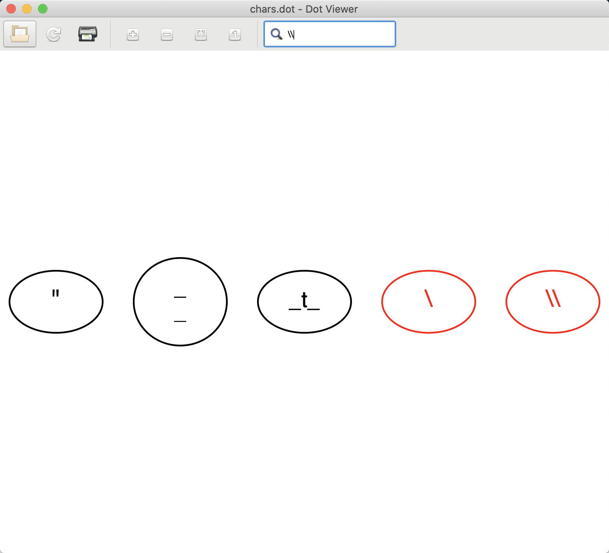

# xdot.py for Mac

## Appearance

## Reference

- https://github.com/jrfonseca/xdot.py.git

- https://github.com/GNOME/adwaita-icon-theme.git

## Fixed some errors like as follows

- 'Error loading theme icon 'zoom-in' for stock:'

## Usage

### Run

- python3 sample.py

### Install

- python3 setup.py install --install-scripts=/usr/local/var/pyenv/shims/

- mac-xdot
